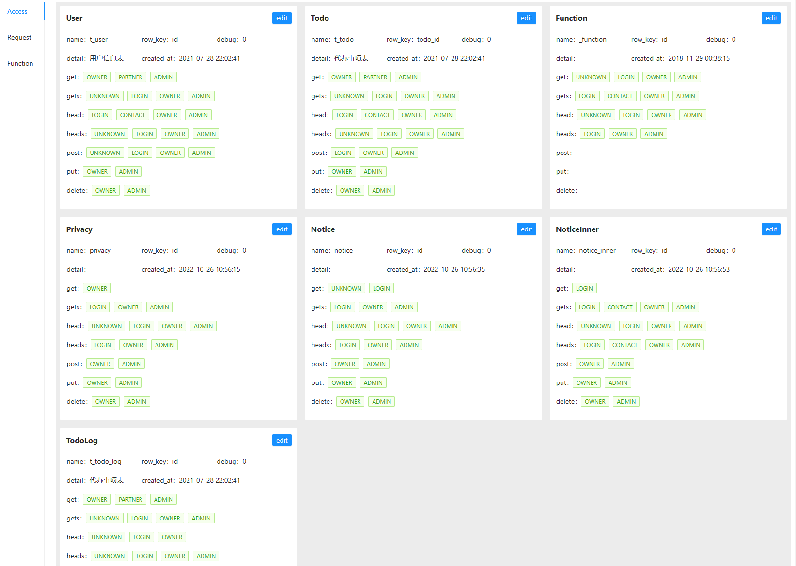
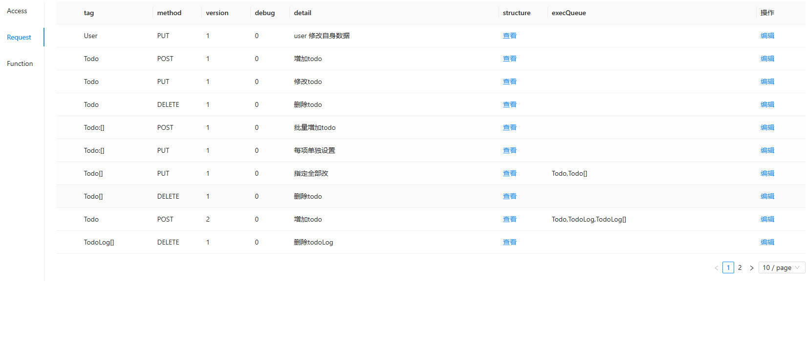

## 截图



## 使用
main.go
```go
package main

import (
	"github.com/glennliao/apijson-go-ui"
	"github.com/glennliao/apijson-go/db"
	_ "github.com/gogf/gf/contrib/drivers/mysql/v2"
	"github.com/gogf/gf/v2/frame/g"
)

func main() {
	db.Init()
	s := g.Server()
	apijson_go_ui.Handler(s)
	s.Run()
}

```
config.toml
```ini
[server]
  address = ":8090"
  dumpRouterMap = false
  debug = false

[logger]
  level = "info"

[database.logger]
  level = "all"
  stdout = true

[database.default]
  debug = true
  timezone = "Asia/Shanghai"
  link = "mysql:root:root@tcp(192.168.31.70:3306)/apijson_go_todo?charset=utf8mb4&parseTime=True&loc=Local"

```
然后访问 http://127.0.0.1:8090/ui/index.html